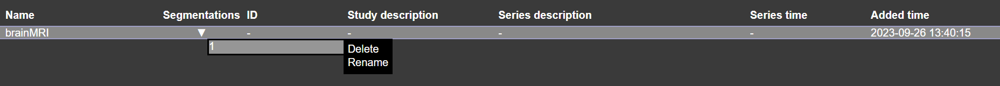
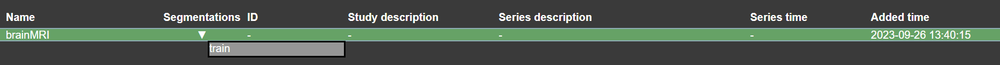

# Building the Model

To train a model, you need to first prepare your dataset by categorizing the images and their corresponding masks.

## Categorizing Your Data:

1. **Indicators on the Dashboard**:  
   After uploading the files and their respective masks, you'll notice a small downward arrow (v). Hovering over this arrow reveals a "1."

    

3. **Setting Training Data**:  
   To designate an image for the training set, rename the "1" to "train."  
  

4. **Setting Validation Data**:  
   For the validation set, rename the "1" to "validate."

5. **Visual Confirmation**:  
   Once categorized, images set for training will turn green, while those for validation will turn orange.  
   

Congratulations! You've successfully partitioned your dataset into training and validation sets.
