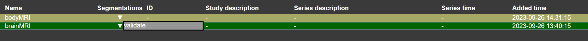

# Building the Model

To train a model, you need to first prepare your dataset by categorizing the images and their corresponding masks. If the mask name isn't chosen during the uploading step, the user can rename it (if needed) by following these instructions.

## Categorizing Your Data:

1. **Indicators on the Dashboard**:  
   After uploading the files and their respective masks, you'll notice a small downward arrow (v). Hovering over this arrow reveals a "1."

    

3. **Setting Training Data**:  
   To designate an image for the training set, rename the "1" to "train."  with right click
  

4. **Setting Validation Data**:  
   For the validation set, rename the "1" to "validate."with right click

5. **Visual Confirmation**:  
   Once categorized, images set for training will turn green, while those for validation will turn orange.

   
   
   
Congratulations! You've successfully partitioned your dataset into training and validation sets.

# Train Data

After uploading all necessary data to the project, users can initiate the training process by clicking on the 'train model' button. Users have the option to select between training a 2D or 3D model. Opting for 3D is recommended if the dataset contains image slices. 

Subsequently, various parameters need to be adjusted to best fit the dataset and to determine the desired training duration. A larger dataset and longer training time typically lead to a more accurate model. The training process will utilize all images and masks that have been labeled as 'train' or 'validate' by the user.

# An Additional Category: Upsampling
By categorizing the mask as "upsampling", users can access further functionality. [see here](upsampling.md)

