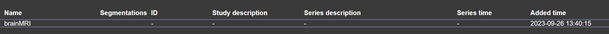

# Execution

Once the setup is complete, users can simply click on `medseg_exe.py` to run MedSeg on their laptop. The browser will automatically open with the appropriate URL, taking users directly to the MedSeg login page.

# Connection 

Users should enter their username and password to access MedSeg.

# Inside MedSeg 

## Creating a New Project

1. Click on the green "Add Project" button.
2. Enter your desired project name.
3. Press "OK".

## Uploading Files 

1. Click on the blue "Upload" button.
2. Select the images you wish to upload.

**Important**: 
- If you're using an image as a primary image or as a mask, their filenames must differ.
  - For a primary image, the naming format should be: `img_MYIMAGE`
  - For the mask of this image, it should be: `msk_MYIMAGE`.
  
  "MYIMAGE" can be replaced with any desired name, but ensure the identifier remains consistent between an image and its corresponding mask.
  
- Files must be in the `.nii.gz` extension. (nifti format ONLY)

- You can put many images at the same time

## Image Upload Example

Below are the steps and visual examples for uploading images and their corresponding masks:

1. **Uploading Your First Image**:  
   Ensure that the image has the correct name and extension.  
   

2. **Verifying the Image Upload**:  
   On your dashboard, you should be able to see that the image has been added successfully.  
   

3. **Adding the Corresponding Mask**:  
   The mask should have the same name as the image but with a `msk` prefix.  
   

4. **Mask Upload Verification**:  
   A small downward arrow (v) in the segmentation column indicates that the mask has been uploaded correctly for the corresponding image.  
   

